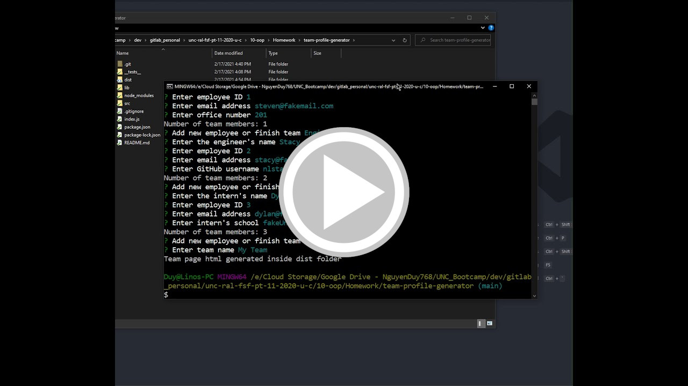

# Team Profile Generator

## Description
    
Team Profile Generator is a CLI application that takes in information about employees on a software engineering team and generates an HTML page that displays their information

## Table of Contents

* [Installation](#installation)
* [Usage](#usage)
* [Preview](#preview)
* [Tests](#tests)
* [Questions](#questions)

## Installation

[Node.js](https://nodejs.org/en/download/) is required.

Run `npm i` to install the required npm packages

## Usage

Run `node index.js`, then the application will you ask you to input each member's information. Once finished an index.html file will be created in the 'dist' folder

## Preview

## Tests

Running 'npm run test' will test each employee class

## Questions

If you have any questions, you can reach me through my github or email below

Github: [LinosM](https://github.com/LinosM)

Email: [NguyenDuy768@gmail.com](mailto:NguyenDuy768@gmail.com)
